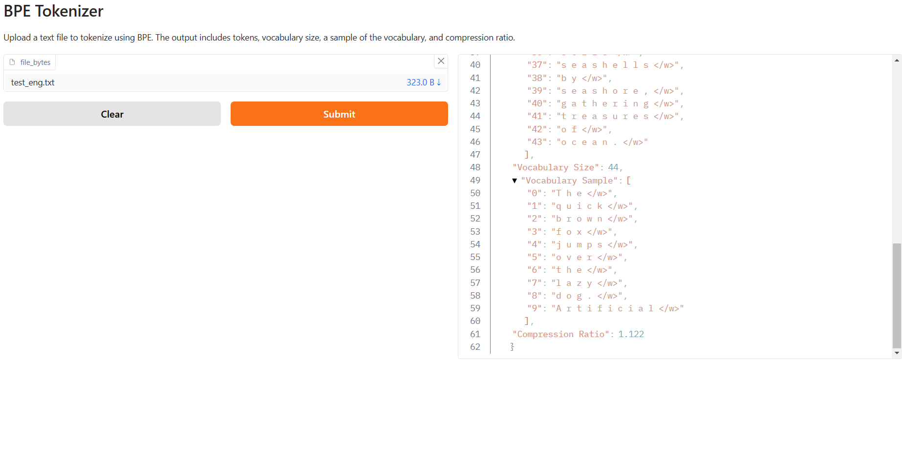

# Byte Pair Encoding (BPE) Tokenizer

 

This project is deployed and running on Hugging Face Space!

Here is the output of the model running on Hugging Face Space:



## Overview
This project implements a Byte Pair Encoding (BPE) tokenizer that processes text in any language. The tokenizer compresses text by iteratively merging the most frequent pairs of characters or subwords, resulting in tokens. It provides insights into the vocabulary size, the length of tokens, and the compression ratio achieved during the process.

---

## Features
- Processes text in **any language**.
- Tokenizes input text using a trained BPE vocabulary.
- Outputs the final tokens for the text.
- Computes:
  - Length of the vocabulary.
  - Total number of tokens generated.
  - Compression ratio.

---

## How It Works
1. **Input Text**: Provide a string of text in any language.
2. **Character Splitting**: Splits the input text into individual characters, appending `</w>` to denote word boundaries.
3. **Pair Merging**: Repeatedly merges the most frequent adjacent character pairs based on the BPE vocabulary until no further merges are possible.
4. **Token Output**: Matches the resulting subwords to the vocabulary, providing tokens for the input text.
5. **Statistics**:
   - **Vocabulary Size**: Total number of unique tokens in the vocabulary.
   - **Token Count**: Number of tokens generated for the input text.
   - **Compression Ratio**: Ratio of original text size to the tokenized size.

---

## Input/Output
### Input
- Text file or string input containing the text to tokenize.
- Predefined BPE vocabulary (can be generated from a training corpus).

### Output
- Tokens: List of subwords/tokens for the input text.
- Vocabulary Size: Number of unique tokens in the vocabulary.
- Compression Ratio: Calculated as:

  \[
  \text{Compression Ratio} = \frac{\text{Length of Original Text}}{\text{Number of Tokens}}
  \]

---

## Installation
### Prerequisites
- Python 3.8+
- Libraries: `numpy`, `pandas` (if required for additional analysis).

### Setup
1. Clone the repository:
   ```bash
   git clone <repository_url>
   ```

2. Install required dependencies:
   ```bash
   pip install -r requirements.txt
   ```

3. Run the script:
   ```bash
   python bpe_tokenizer.py --input_file <path_to_text_file> --vocab_file <path_to_vocab>
   ```

---

## Usage
### Command-Line Interface
To run the tokenizer from the command line:
```bash
python bpe_tokenizer.py --input_file <path_to_text_file> --vocab_file <path_to_vocab>
```
### Example
Input File:
```text
ರಾಮಾಯಣ ಹಿಂದೂಗಳ ಪವಿತ್ರ
```
Vocabulary File:
```text
ರ ಾ ಮ ಾ ಯ ಣ</w>
ಹ ಿ ಂ ದ ೂ ಗ ಳ</w>
ಪ ವ ಿ ತ ್ ರ</w>
```
Command:
```bash
python bpe_tokenizer.py --input_file input.txt --vocab_file vocab.txt
```
Output:
```text
Tokens: ['ರ ಾ ಮ ಾ ಯ ಣ</w>', 'ಹ ಿ ಂ ದ ೂ ಗ ಳ</w>', 'ಪ ವ ಿ ತ ್ ರ</w>']
Vocabulary Size: 3
Number of Tokens: 3
Compression Ratio: 1.67
```

---

## Results
- **Tokens**: The subwords generated for the input text.
- **Vocabulary Size**: The total number of unique entries in the vocabulary.
- **Compression Ratio**: Demonstrates the effectiveness of tokenization in reducing the text size.

---

## Future Enhancements
- Add dynamic vocabulary generation from the input text.
- Include support for custom merge rules and training.
- Optimize tokenization speed for larger datasets.

---

## License
This project is licensed under the [MIT License](LICENSE).

